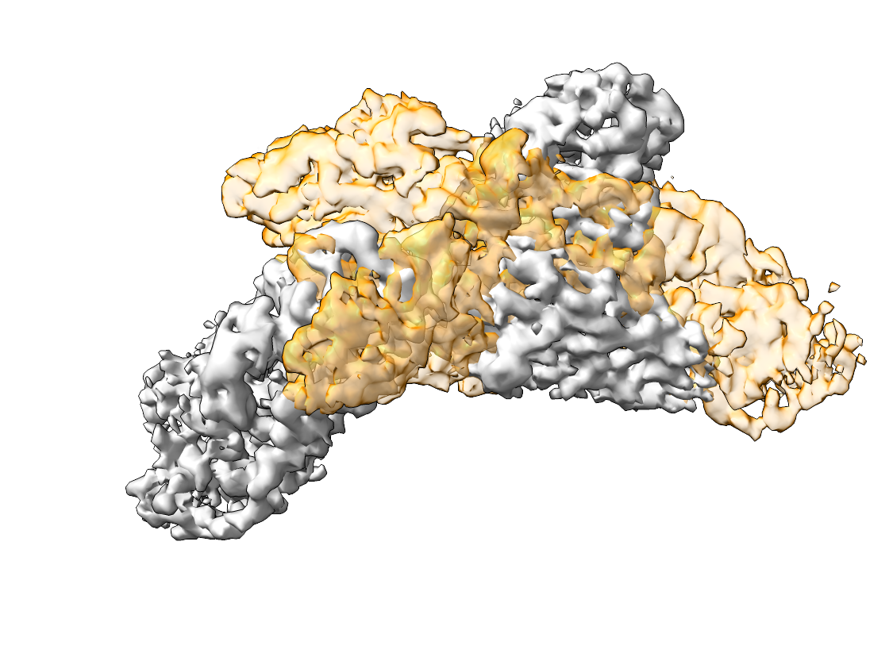
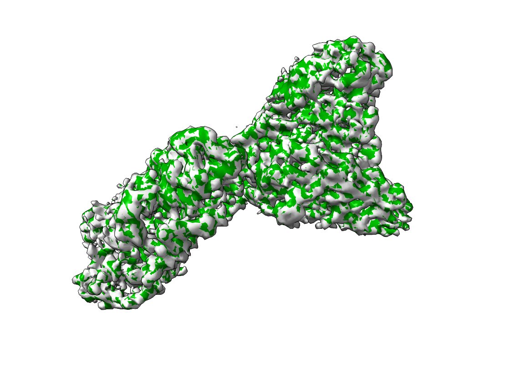

.. include:: ../../substitutions.rst

======================
Alignment of Densities
======================

In the following we will use template matching to recover the correct orientation of a density map within another density map.

To demonstrate the procedure, we will use EMD-15271. You can download it from the `EMDB <https://www.ebi.ac.uk/emdb/EMD-15271>`_ or from the command line

.. code-block:: bash

    wget https://ftp.ebi.ac.uk/pub/databases/emdb/structures/EMD-15271/map/emd_15271.map.gz

We will first simulate a translation and rotation of the map

.. code-block:: python

    import numpy as np
    from tme import Density
    from tme.rotations import get_rotation_matrices

    rotation_matrix = get_rotation_matrices(40)[32]

    density = Density.from_file("emd_15271.map.gz")
    density, _ = density.centered(0) # Create a sufficiently sized volume for rotation
    density_mod = density.rigid_transform(
        rotation_matrix = rotation_matrix
    )
    density_mod.origin = np.add(
        density.origin, np.multiply((-10, 5, 0), density.sampling_rate)
    )

    density.to_file("emd_15271.mrc")
    density_mod.to_file("emd_15271_mod.mrc")

The following will recover the correct orientation between the densities

.. code-block:: bash

    match_template.py   \
        -m emd_15271.mrc \
        -i emd_15271_mod.mrc \
        -a 40 \
        -n 4

The orientation with highest score, which in our case is the initial correct orientation, can be obtained from the created pickle files like so

.. code-block:: bash

    postprocess.py \
        --input-file output.pickle \
        --num-peaks 1 \
        --output-format alignment \
        --output-prefix emd_15271_fit

The aligned densities are displayed below. The left side shows the map and `emd_15271_mod.mrc`, the right side the output of |project|.

