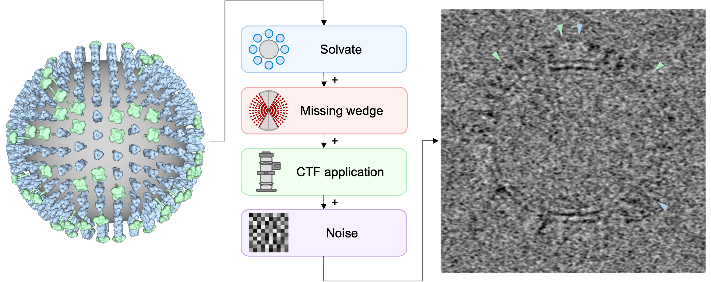
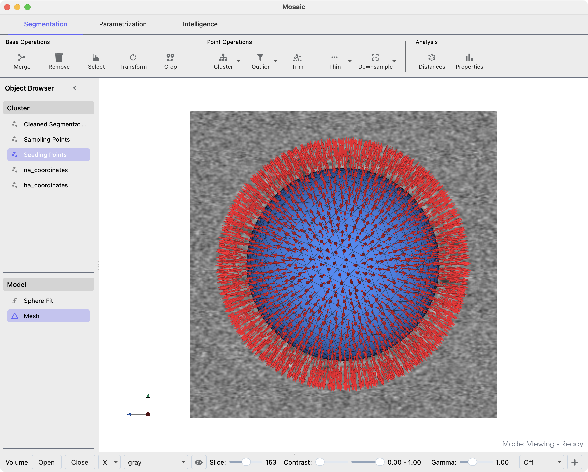
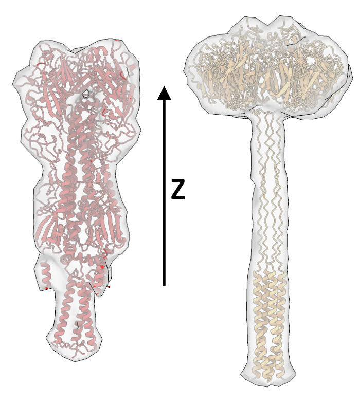
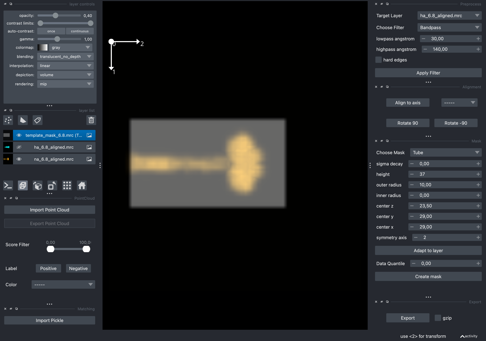
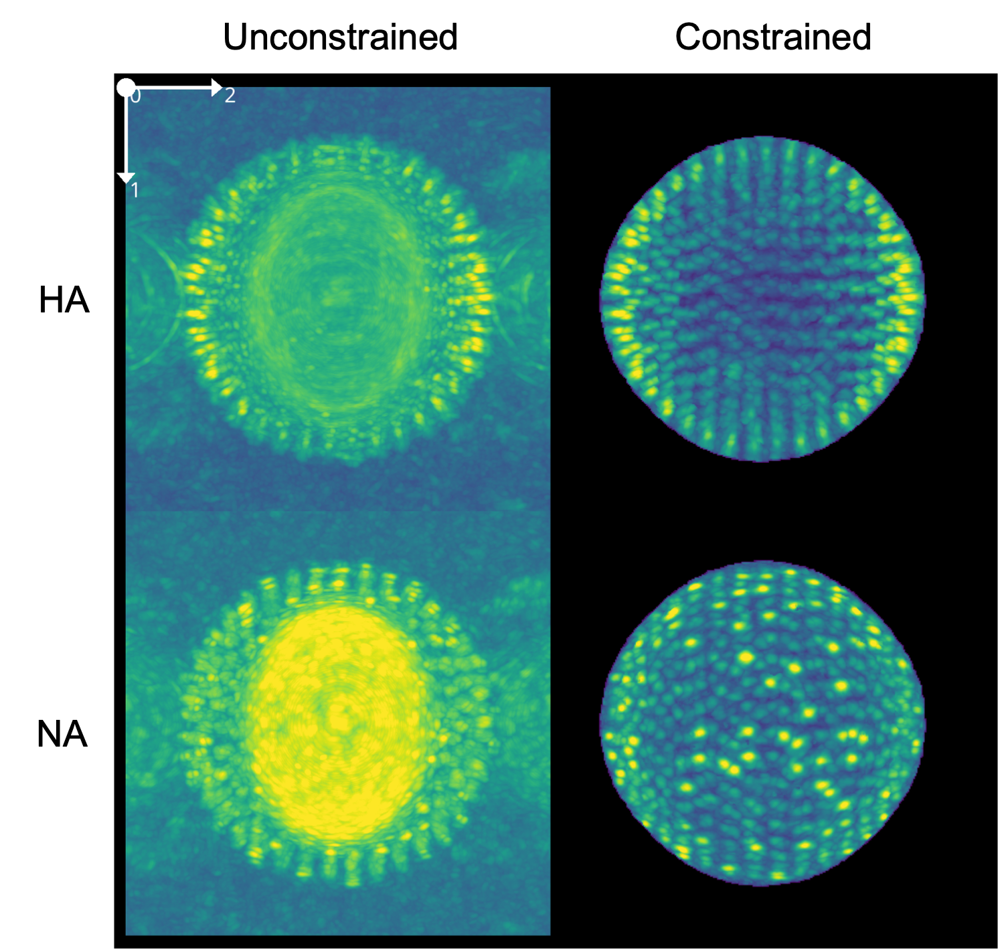

.. include:: ../../substitutions.rst

=============================
Constrained Template Matching
=============================

Constrained template matching builds upon standard template matching by integrating prior knowledge about where and how particles are oriented in the data. This is particularly valuable for membrane-associated proteins, with known relative orientation to the membrane surface. Such constraints are imposed by seed points, which can be generated from surface parametrizations, but could also originate from unrefined initial picks, e.g., picks from deep-learning without corresponding angular assignment.

Here, we use a specific formulation of constrained template matching that remains computationally efficient and accurate in large or highly curved biological systems [1]_. In the following, we demonstrate the typical workflow for a synthetic Influenza A virus (IAV), where we identify the two glycoproteins hemagglutinin (HA) and neuraminidase (NA) using template matching.

   Simulating IAV tomograms using Mepsi [2]_.

Prerequisites
-------------

Before starting with constrained template matching, ensure you have access to

- GPU with CUDA support
- 16 GB of RAM

You can optionally install `Mosaic <https://github.com/maurerv/mosaic>`_ to generate seed points.

.. note::

    Constrained template matching is available from version 0.3.0 and above.

Data Structure
--------------

All data used throughout the example is available from `ownCloud <https://oc.embl.de/index.php/s/KhbLe0Y1JI61ct8>`_. The data is organized as follows

.. code-block::

    iav_example/
    ├── tomogram_solvated_ctf_noise.mrc # Simulated IAV tomogram
    ├── tomogram_segmentation.mrc       # Membrane segmentation
    ├── tilt_angles.txt                 # Tilt angles for missing wedge correction
    ├── *.sh                            # Scripts for preprocessing and matching
    ├── templates/
    │   ├── ha.pdb                      # HA structure
    │   ├── na.pdb                      # NA structure
    │   ├── ha_6.8_aligned.mrc          # Preprocessed HA template
    │   ├── na_6.8_aligned.mrc          # Preprocessed NA template
    │   └── template_mask_6.8.mrc       # Template mask
    ├── seed_points/
    │   ├── SeedingPoints_40_80.star    # Pre-generated seed points
    │   └── picks.star                  # HA/NA picks
    └── results/
        ├── ha_matching.pickle          # Constrained HA matching results
        ├── na_matching.pickle          # Constrained NA matching results
        ├── ha.pickle                   # Unconstrained HA matching results
        └── na.pickle                   # Unconstrained NA matching results

You can mirror this structure locally to follow along with the example.

Generating Seed Points
----------------------

When working with membrane proteins, we like to generate seed points using membrane mesh representations from Mosaic [3]_. Mosaic is a graphical user interface that unifies deep-learning-based membrane segmentation, interactive refinement and mesh generation and is available from `GitHub <https://github.com/maurerv/mosaic>`_.

.. note::

    You can use your own methods for generating seed points. Constrained template matching merely expects a STAR file as specification of the constraints with columns for coordinates (rlnCoordinateX, rlnCoordinateY, rlnCoordinateZ) and zyz angles (rlnAngleRot, rlnAngleTilt, rlnAnglePsi).

Briefly, Mosaic uses membrain-seg [4]_ to create an initial segmentation of the viral membrane. This process can be triggered using the **Membrane** button in the **Intelligence** tab. Since the membrane is well resolved, we only need to remove noise clusters prior to mesh creation.

..  youtube:: Qb_qzMMBjSI
   :width: 100%

To parametrize the virus geometry, we select the outer membrane cluster and click the **Sphere** button in the **Parametrization** tab. Subsequently, we **Sample** points from the sphere model and fit a convex hull using **Mesh**. We can now draw seed points from the created mesh. The seed points should roughly align with the center of mass of the glycoproteins, because this is where the templates are expected to match. This alignment does not have to be very precise, but it helps to further constrain matching down the line. You can draw seed points by clicking the drop-down arrow of the **Sample** button, changing the *Mode* to *Distance* and

- Sampling (40 Å): This controls the distance between adjacent seed points on the surface. Smaller values create denser sampling with more seed points.
- Offset (80 Å): This moves seed points away from the membrane surface along the normal vector. For this IAV example, 80 Å positions the seed points approximately at the center of mass of the glycoproteins.

   Membrane mesh in blue and drawn seed points in red.

The distance distribution between seed points and relative to the mesh can be assessed using the **Properties** button in the **Segmentation** tab. To export the created points, right-click the corresponding cluster object and export it as STAR file.

.. tip::

    The Mosaic tutorial features `additional examples <https://kosinskilab.github.io/mosaic/tutorial/workflows/iav.html>`_.

Creating Templates
------------------

To integrate orientational constraints, we need to ensure the template used for matching is in a consistent orientation. Here, we align the principal axis of the template to the z-axis of the coordinate system

.. code-block:: bash

    preprocess.py \
        -m templates/ha.pdb \
        -o templates/ha_6.8_aligned.mrc \
        --sampling-rate 6.8 \
        --lowpass 15 \
        --box-size 60 \
        --invert-contrast \
        --align-axis 2

    preprocess.py \
        -m templates/na.pdb \
        -o templates/na_6.8_aligned.mrc \
        --sampling-rate 6.8 \
        --lowpass 15 \
        --box-size 60 \
        --align-axis 2

.. note::

    In some cases we need to provide the ``--flip-axis`` flag due to the handedness of the alignment problem. When aligning a protein structure to a principal axis, the algorithm determines the orientation based on the distribution of mass around the center. However, this can result in two possible orientations that are 180° apart - the protein could point "up" or "down" along the chosen axis.

After alignment, your templates should look similar to what is shown here, with the transmembrane region pointing in the direction of negative z and the extracellular domain pointing in direction of z

   HA (left) and NA (right) template densities.

.. note::

    For proteins where the alignment axis is not the axis with maximal variation, e.g., membrane proteins including sections of the membrane, the ``--align_eigenvector`` needs to be adapted (typically to 2 in such cases). For 3D data this value can either be 0, 1, or 2, with the default value being 0.

Creating Template Masks
-----------------------

Given the overall shape similarity between HA and NA, we can use a cylindrical mask for both. The mask can be created using the ``preprocessor_gui.py`` utility, by selecting Mask > Tube with height 37, outer radius 10, inner radius 0, center z 23.50, center y 29, center x 29 and symmetry axis 2 (the size of the mask is specified in voxels). Click on the created mask in the layer list and use the **Export** button to write it to disk.

   Using the napari GUI to create template matching masks. You can use the *Invert Contrast* filter to visualize the templates.

.. tip::

    In general, we find it's beneficial to not make the mask too narrow. For HA for instance, a cylindrical mask of that diameter is not ideal (it should be larger), but sufficient for the data we are dealing with here. Furthermore, the mask should not include excessive amounts of membrane density, but rather focus on peripheral template components.

Alternatively, you can do this using Python

.. code-block:: python

    from tme import Density
    from tme.matching_utils import create_mask

    mask = create_mask(
        mask_type="tube",
        shape=(60,60,60),
        symmetry_axis=2,
        center=(29,29,23.5),
        inner_radius=0,
        outer_radius=10,
        height=37
    )
    Density(mask, sampling_rate=6.8).to_file("template_mask_6.8.mrc")

Template Matching
-----------------

The only difference to unconstrained template matching is that the seed points need to be passed to ``match_template.py`` via the ``--orientations`` argument.

.. code-block:: bash

    match_template.py \
        -m tomogram_solvated_ctf_noise.mrc \
        -i templates/ha_6.8_aligned.mrc \
        --template-mask templates/template_mask_6.8.mrc \
        -s FLC \
        --angular-sampling 10 \
        --backend cupy \
        --orientations seed_points/SeedingPoints_40_80.star \
        --orientations-cone 20 \
        --orientations-uncertainty 6,6,10 \
        --defocus 50000 \
        --tilt-angles tilt_angles.txt \
        -o results/ha_matching.pickle

For NA, simply use ``-i templates/na_6.8_aligned.mrc`` and ``-o results/na_matching.pickle``. We recommend running the above on a GPU using the cupy or jax backend as shown.

- ``--orientations-cone 20``: Limits template orientations to within a 20-degree cone around the normal vector of each seed point. This ensures that particles are only matched in biologically relevant orientations (e.g., membrane proteins oriented relative to the membrane surface).

- ``--orientations-uncertainty 6,6,10``: Defines an ellipsoidal search region around each seed point in voxels. The values represent the search radii in x, y, and z directions respectively. This accounts for uncertainty in the exact position of particles relative to seed points.

- ``--defocus 50000``: Defocus value in Ångstrom for CTF correction (5 μm defocus).

.. tip::

    You can also constrain the rotational search to account for properties like template symmetry. For instance for the C3 symmetric HA, try replacing ``--angular-sampling 10`` with ``--cone-angle 180 --cone-sampling 10 --axis-symmetry 3``.

The output of constrained template matching is a pickle file containing the score space and identified orientations. We can explore the score space in the ``preprocessor_gui.py`` using the **Import Pickle** button. Shown below is a comparison of HA and NA matching using constrained and unconstrained matching, respectively. Note the increase in peak sharpness and decreased contribution of the membrane density in constrained matching.

    Comparison of scores acquired from constrained and unconstrained matching of HA and NA.

Analysis
--------

The output of constrained template matching can be used in the default postprocessing schemes, e.g., for particle picking. The following will use both matching results and identify no more than 475 particles with a minimum spacing of 12 voxels, which is in the order of the expected 10nm glycoprotein spacing. Whether a given pick corresponds to an HA or NA instance is indicated in ``_rlnClassNumber``.

.. code-block:: bash

    postprocess.py \
      --input-file results/ha_matching.pickle results/na_matching.pickle \
      --peak-caller PeakCallerMaximumFilter \
      --num-peaks 475 \
      --min-distance 12 \
      --output-format relion4 \
      --output-prefix orientations/picks

This should provide you with a decent particle set. However, since we are confident that the angles we determined are reasonable, we constrained them after all, we can use a different peak calling algorithm to express that. Instead of dividing the scores into a regular grid with spacing ``--min-distance``, ``--peak-caller PeakCallerRecursiveMasking`` will identify peaks sequentially and mask scores around it using the identified template orientation and provided mask.

.. code-block:: bash

    postprocess.py \
      --input-file results/ha_matching.pickle results/na_matching.pickle \
      --peak-caller PeakCallerMaximumFilter \
      --num-peaks 475 \
      --min-distance 12 \
      --output-format relion4 \
      --output-prefix orientations/picks

.. tip::

    See the :doc:`postprocessing section <../postprocessing/motivation>` for all options.

References
----------

.. [1] Maurer, V. J., Grunwald, L., Kennes, D. M., Kosinski, J. Constrained template matching using rejection sampling. bioRxiv 2025
.. [2] Rodriguez de Francisco, B., Bezault A., Xu, X. P., Hanein, D., Volkmann, N. MEPSi: A tool for simulating tomograms of membrane-embedded proteins JSB 214, 107921 (2022).
.. [3] Maurer, V. J., Siggel, M., Jensen, R. K., Mahamid, J., Kosinski, J., Pezeshkian, W. Helfrich Monte Carlo Flexible Fitting: physics-based, data-driven cell-scale simulations. bioRxiv 2025
.. [4] Lamm, L., Sieber, J., Chung, J.E. et al. (2024). MemBrain-seg: Deep learning-based segmentation of cellular membranes in cryo-electron tomography. bioRxiv, doi.org/10.1101/2024.01.05.574336
