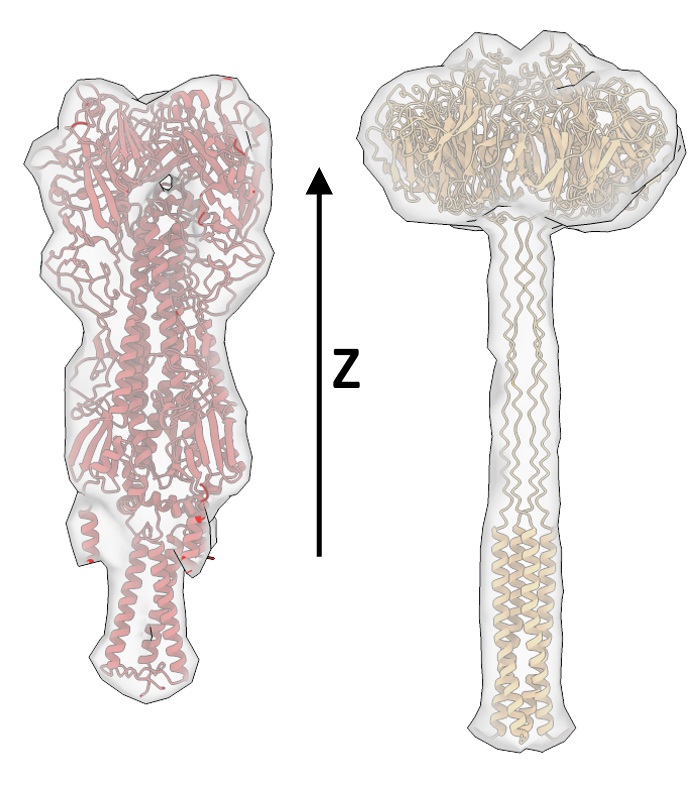

.. include:: ../../substitutions.rst

=============================
Constrained Template Matching
=============================

Constrained template matching builds upon standard template matching by integrating prior knowledge about where and how particles are oriented in the data. This is particularly valuable for membrane-associated proteins, with known relative orientation to membrane surface. Such constraints can be described through seed points, which can be generated from surface parametrizations, but could also originate from unrefined initial picks, e.g., picks from deep-learning without corresponding angular assignment.

Here, we use a specific formulation of constrained template matching that remains computationally efficient and accurate in large or highly curved biological systems [1]_. In the following, we demonstrate the typical workflow for a synthetic Influenza A virus (IAV), where we identify the two glycoproteins hemagglutinin (HA) and neuraminidase (NA) using template matching.

.. figure:: ../../_static/examples/constrained/data_overview.png
   :width: 100 %

   Simulating IAV tomograms using Mepsi [2]_.

Prerequisites
-------------

Before starting with constrained template matching, ensure you have access to

- GPU with CUDA support
- 16 GB of RAM

You can optionally install `Mosaic <https://github.com/maurerv/mosaic>`_ to generate seed points.

.. note::

    Constrained template matching is currently only available in the beta-release. You can acquire it by installing from GitHub

    .. code-block:: bash

        pip install git+https://github.com/KosinskiLab/pyTME.git

    or from PyPi via

    .. code-block:: bash

        pip install "pytme==0.3.0b"

Data Structure
--------------

All data used throughout the example is available from `ownCloud <https://oc.embl.de/index.php/s/KhbLe0Y1JI61ct8>`_. The data is organized as follows

.. code-block::

    iav_example/
    ├── tomogram_solvated_ctf_noise.mrc       # Simulated IAV tomogram
    ├── tilt_angles.txt                       # Tilt series angles for missing wedge correction
    ├── templates/
    │   ├── ha.pdb                           # Hemagglutinin structure
    │   ├── na.pdb                           # Neuraminidase structure
    │   ├── ha_6.8_aligned.mrc               # Preprocessed HA template
    │   ├── na_6.8_aligned.mrc               # Preprocessed NA template
    │   └── template_mask_6.8.mrc            # Template mask
    ├── seed_points/
    │   └── SeedingPoints_40_80.star         # Pre-generated seed points
    └── results/
        ├── ha_matching.pickle               # HA matching results
        └── na_matching.pickle               # NA matching results

You can mirror this structure locally to follow along with the example.

Generating Seed Points
----------------------

When working with membrane proteins, we like to generate seed points using membrane mesh representations from Mosaic [3]_. Mosaic is a graphical user interface that unifies deep-learning-based membrane segmentation, interactive refinement and mesh generation and is available from `GitHub <https://github.com/maurerv/mosaic>`_.

.. note::

    You can use your own methods for generating seed points. Constrained template matching merely expects a STAR file as specification of the constraints with columns for coordinates (rlnCoordinateX, rlnCoordinateY, rlnCoordinateZ) and zyz angles (rlnAngleRot, rlnAngleTilt, rlnAnglePsi).

Briefly, Mosaic uses membrain-seg [4]_ to create an initial segmentation of the viral membrane. This process can be triggered using the **Membrane** button in the **Intelligence** tab. Since the membrane is well resolved, the segmentation does not require extensive manual refinement and can directly be used for mesh creation.

.. figure:: ../../_static/examples/constrained/iav_segmentation.png
   :width: 100 %

   IAV membrane segmentation in Mosaic. Shown is a yz-projection of the simulated tomogram and the membrane segmentation in red.

The simple spherical geometry of the virus can be described by a convex hull, which we can fit in Mosaic by selecting the membrane segmentation and clicking the **Mesh** button in the **Parametrization** tab. We can now draw seed points from the created mesh. We want the seed points to roughly align with the center of mass of the glycoproteins, because this is where we expect template matches. This alignment does not have to be very precise, but it helps to further constraint matching down the line. You can achieve this by clicking the drop-down arrow of the **Sample** button, changing the *Mode* to *Distance*, the sampling to *40* and the offset to *80*.

- Sampling (40 Å): This controls the distance between adjacent seed points on the surface. Smaller values create denser sampling with more seed points.
- Offset (80 Å): This moves seed points away from the membrane surface along the normal vector. For this IAV example, 80 Å positions the seed points approximately at the center of mass of the glycoproteins.

.. figure:: ../../_static/examples/constrained/iav_seedpoints.png
   :width: 100 %

   Membrane mesh in blue and drawn seed points in red.

The distance distribution between seed points and relative to the mesh can be assessed using the **Properties** button in the **Segmentation** tab. To export the created points, right-click the corresponding cluster object and export it as STAR file.

.. tip::

    If you like to learn more about Mosaic, feel free to check out `this example <https://kosinskilab.github.io/mosaic/tutorial/workflows/iav.html>`_.

Creating Templates
------------------

To integrate orientational constraints, we need to ensure the template used for matching is in a consistent orientation. Here, we align the principal axis of the template to the z-axis of the coordinate system

.. code-block:: bash

    preprocess.py \
        -m templates/ha.pdb \
        -o templates/ha_6.8_aligned.mrc \
        --sampling_rate 6.8 \
        --lowpass 15 \
        --box_size 60 \
        --align_axis 2

    preprocess.py \
        -m templates/na.pdb \
        -o templates/na_6.8_aligned.mrc \
        --sampling_rate 6.8 \
        --lowpass 15 \
        --box_size 60 \
        --align_axis 2 \
        --flip_axis

For NA we need to provide the ``--flip_axis`` flag due to the handedness of the alignment problem. When aligning a protein structure to a principal axis, the algorithm determines the orientation based on the distribution of mass around the center. However, this can result in two possible orientations that are 180° apart - the protein could point "up" or "down" along the chosen axis.

After alignment, your templates should look similar to what is shown here, with the transmembrane region pointing in the direction of negative z and the extracellular domain pointing in direction of z

   HA (left) and NA (right) template densities.

.. note::

    For proteins where the alignment axis is not the axis with maximal variation, e.g., membrane proteins including sections of the membrane, the ``--align_eigenvector`` needs to be chosen carefully. For 3D data this value can either be 0, 1, or 2, with the default value being 0.

Creating Template Masks
-----------------------

Given the overall shape similarity between HA and NA, we can use a cylindrical mask for both. The mask can be created using the ``preprocessor_gui.py`` utility, by selecting Mask > Tube with height 37, outer radius 10, inner radius 0, center z 23.50, center y 29, center x 29 and symmetry axis 2. Click on the created mask in the layer list and use the Export button to write it to disk.

.. figure:: ../../_static/examples/constrained/masks.png
   :width: 100 %

   Using the napari GUI to create template matching masks.

Alternatively, you can do this using Python

.. code-block:: python

    from tme import Density
    from tme.matching_utils import create_mask

    mask = create_mask(
        mask_type="tube",
        shape=(60,60,60),
        symmetry_axis=2,
        base_center=(29,29,23.5),
        inner_radius=0,
        outer_radius=10,
        height=37
    )
    Density(mask, sampling_rate=6.8).to_file("template_mask_6.8.mrc")

Template Matching
-----------------

The only difference to unconstrained template matching is that the seed points need to be passed to ``match_template.py`` via the ``--orientations`` argument.

.. code-block:: bash

    match_template.py \
    -m tomogram_solvated_ctf_noise.mrc \
    -i templates/ha_6.8_aligned.mrc \
    --template_mask templates/template_mask_6.8.mrc \
    -s FLC \
    --no_centering \
    -a 7 \
    --backend cupy \\
    --memory_scaling 1.0 \\
    --orientations seed_points/SeedingPoints_40_80.star \
    --orientations_scaling 1.0 \
    --orientations_cone 20 \
    --orientations_uncertainty 6,6,10 \
    --wedge_axes 2,0 \
    --defocus 50000 \
    --pad_edges \
    --invert_target_contrast \
    --tilt_angles tilt_angles.txt \
    -o ha_matching.pickle

For NA, simply replace the path in ``-i`` using the path to `templates/na_6.8_aligned.mrc` and change the path in ``-o`` to `results/na_matching.pickle`. We recommend running the above on a GPU using the cupy backend as shown.

- ``--orientations_cone 20``: Limits template orientations to within a 20-degree cone around the normal vector of each seed point. This ensures that particles are only matched in biologically relevant orientations (e.g., membrane proteins oriented relative to the membrane surface).

- ``--orientations_uncertainty`` 6,6,10: Defines an ellipsoidal search region around each seed point in voxels. The values represent the search radii in x, y, and z directions respectively. This accounts for uncertainty in the exact position of particles relative to seed points.

- ``--orientations_scaling 1.0``: Scaling factor for seed point coordinates. Use 1.0 when seed points and tomogram are at the same voxel size.

- ``--wedge_axes 2,0``: Specifies the projection axis (z=2) and tilt axis (x=0) used during tilt series acquisition.

- ``--defocus 50000``: Defocus value in Ångstrom for CTF correction (5 μm defocus).

The output of constrained template matching is a pickle file containing the score space and identified orientations. We can explore the score space in the ``preprocessor_gui.py`` using the **Import Pickle** button. Shown below is a comparison of HA and NA matching using constrained and unconstrained matching, respectively. Note the increase in peak sharpness and decreased contribution of the membrane density in constrained matching. Achieving more uniform matching scores for HA would require a more stringently created mask. In essence, HAs orthogonal to the missing wedge score lower, because applying a wedge mask to the template density stretches the template, and pushes a considerable amount outside the mask. Alternatively, background correction could be performed, for instance using ``--scramble_phases``.

.. figure:: ../../_static/examples/constrained/scores.png

    Comparison of scores acquired from constrained and unconstrained matching of HA and NA.

Analysis
--------

The output of constrained template matching can be used in the default postprocessing schemes, e.g., for particle picking. See the :doc:`postprocessing section <../postprocessing/summary>` for more details.

References
----------

.. [1] Maurer, V. J., Grunwald, L., Kennes, D. M., Kosinski, J. Constrained template matching using rejection sampling. bioRxiv 2025
.. [2] Rodriguez de Francisco, B., Bezault A., Xu, X. P., Hanein, D., Volkmann, N. MEPSi: A tool for simulating tomograms of membrane-embedded proteins JSB 214, 107921 (2022).
.. [3] Maurer, V. J., Siggel, M., Jensen, R. K., Mahamid, J., Kosinski, J., Pezeshkian, W. Helfrich Monte Carlo Flexible Fitting: physics-based, data-driven cell-scale simulations. bioRxiv 2025
.. [4] Lamm, L., Sieber, J., Chung, J.E. et al. (2024). MemBrain-seg: Deep learning-based segmentation of cellular membranes in cryo-electron tomography. bioRxiv, doi.org/10.1101/2024.01.05.574336
