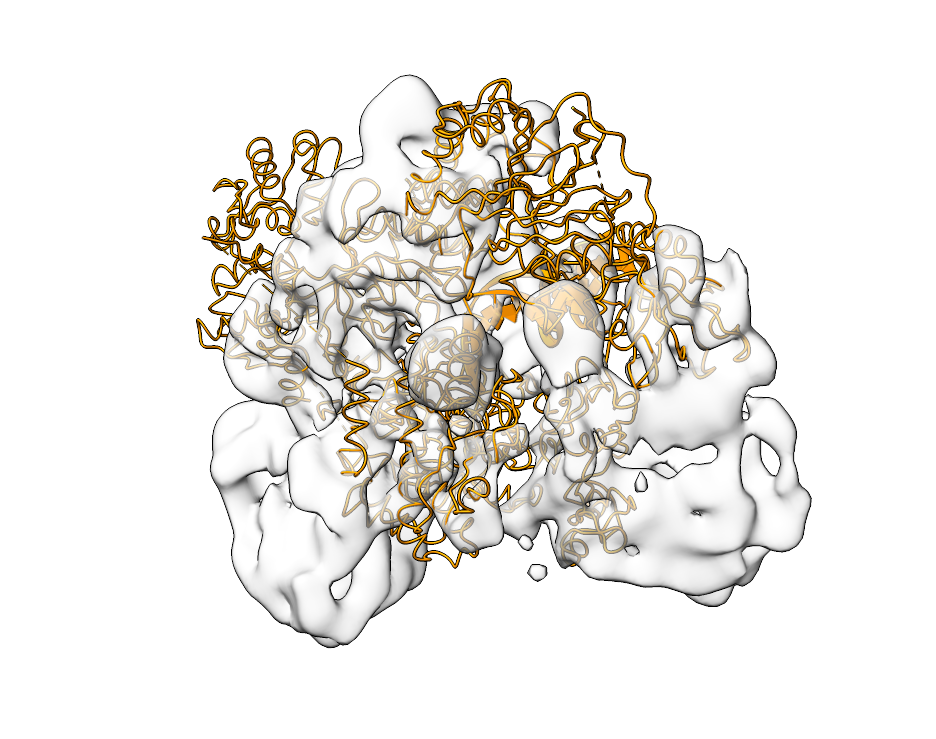
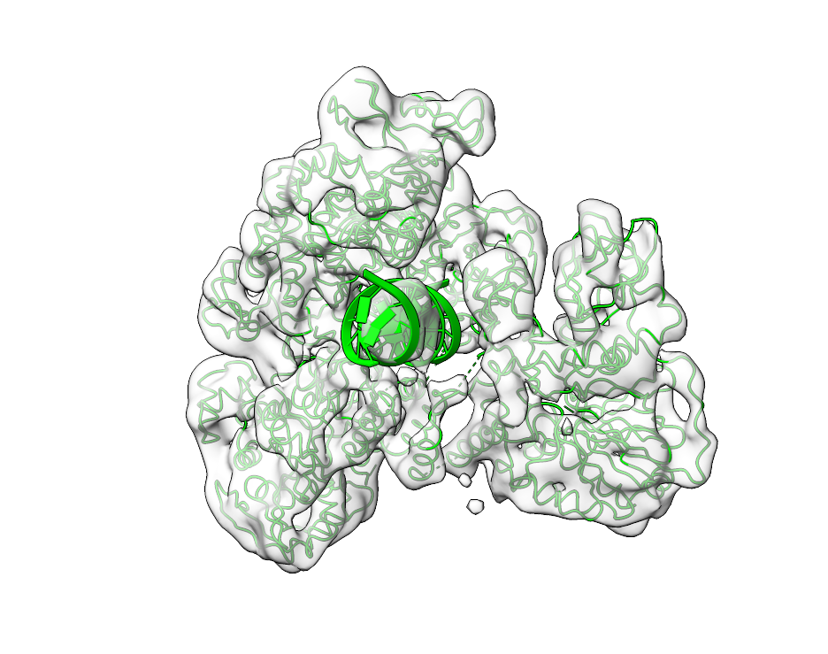

.. include:: ../../substitutions.rst

=========================
Fitting Atomic Structures
=========================

In the following we will use template matching to recover the correct orientation of an atomic structure in a density map.

To demonstrate the procedure, we will use EMD-0244 and the associated fitted structure 6HMS. You can download both from `EMDB <https://www.ebi.ac.uk/emdb/EMD-0244>`_ or from the command line

.. code-block:: bash

    wget https://ftp.ebi.ac.uk/pub/databases/emdb/structures/EMD-0244/map/emd_0244.map.gz
    wget https://files.rcsb.org/download/6HMS.pdb

Since 6HMS is already in the correct orientation, we will first simulate a translation and rotation of the structure

.. code-block:: python

    from tme import Structure
    from tme.matching_utils import get_rotation_matrices

    rotation_matrix = get_rotation_matrices(40)[32]

    structure = Structure.from_file("6HMS.pdb")
    structure_mod = structure.rigid_transform(
        rotation_matrix = rotation_matrix,
        translation = (-15, 10, 0)
    )
    structure_mod.to_file("6HMS_mod.pdb")

The following will fit the newly created structure `6HMS_mod.pdb` into the original density map to recover the correct orientation

.. code-block:: bash

    match_template.py \
        -m emd_0244.map.gz \
        -i 6HMS_mod.pdb \
        -n 4 \
        -a 40 \
        -o output.pickle

We can also apply various filters to the atomic structure, such as a lowpass filter to 30 Ångstrom, and crop the map to its contour level to improve computational efficiency

.. code-block:: bash

    match_template.py \
        -m emd_0244.map.gz \
        -i 6HMS_mod.pdb \
        -n 4 \
        -a 40 \
        --cutoff_target 0.58 \
        --lowpass 30 \
        -o output_mod.pickle

The orientation with highest score, which in our case is the initial correct orientation, can be obtained from the created pickle files like so

.. code-block:: bash

    postprocess.py \
        --input_file output.pickle \
        --number_of_peaks 1 \
        --output_format alignment \
        --output_prefix 6HMS_fit

The postprocessing tool offers a range of additional features to enable subvoxel precision such as peak oversampling via ``--peak_oversampling``  and local optimization via the ``--local_optimization`` flag. The output of fitting is shown below. The left side shows the map and `6HMS_mod.pdb`, the right side the output of |project|.

