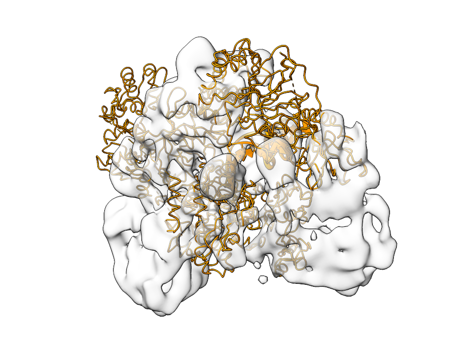
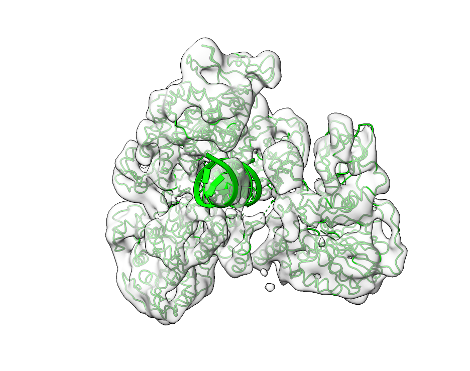
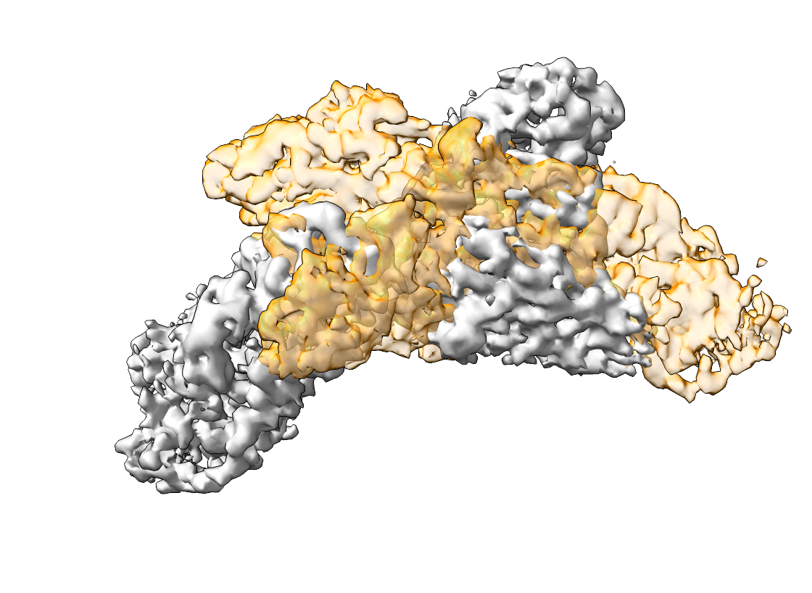
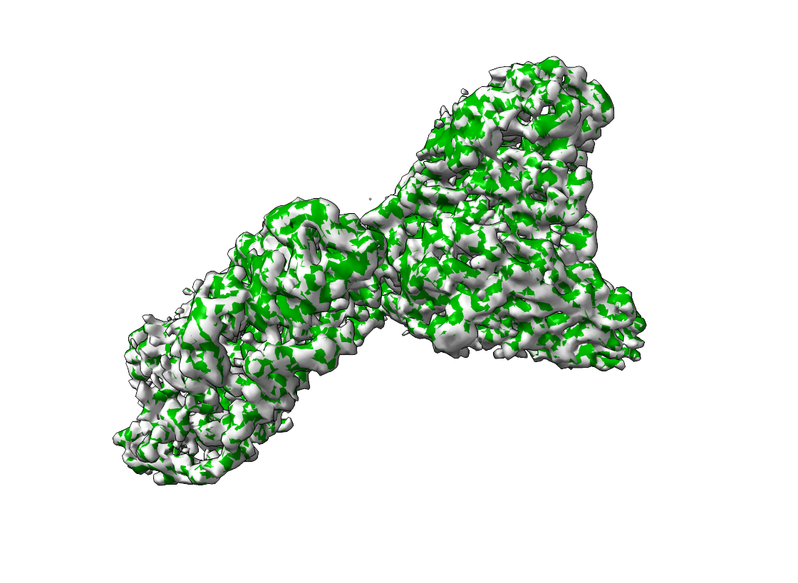

.. include:: ../../substitutions.rst

=====================
Fitting and Alignment
=====================

Template matching can recover the orientation of a reference inside a target
density. The reference can be an atomic structure or another density map, and
both flow through the same pipeline. This page walks through both cases and
then shows how to refine results to sub-voxel precision.

Atomic Structures
=================

We use EMD:0244 and PDB:6HMS to illustrate the fitting of an
atomic structure into a density map. Download both from `EMDB
<https://www.ebi.ac.uk/emdb/EMD-0244>`_ or from the command line.

.. code-block:: bash

    wget https://ftp.ebi.ac.uk/pub/databases/emdb/structures/EMD-0244/map/emd_0244.map.gz
    wget https://files.rcsb.org/download/6HMS.pdb

Since the structure is already in the correct orientation, we first
simulate a translation and rotation

.. code-block:: python

    from tme import Structure
    from tme.rotations import get_rotation_matrices

    rotation_matrix = get_rotation_matrices(40)[32].T

    structure = Structure.from_file("6HMS.pdb")
    structure_mod = structure.rigid_transform(
        rotation_matrix = rotation_matrix,
        translation = (-15, 10, 0)
    )
    structure_mod.to_file("6HMS_mod.pdb")

The following fits the perturbed structure into the density map to recover
the original orientation.

.. code-block:: bash

    pytme match \
        -m emd_0244.map.gz \
        -i 6HMS_mod.pdb \
        -n 4 \
        -a 40 \
        --centering \
        -o output.pickle

The orientation with the highest score, which in this case matches the
original, can be extracted from the pickle file.

.. code-block:: bash

    pytme postprocess \
        --input-file output.pickle \
        --num-peaks 1 \
        --output-format alignment \
        --output-prefix 6HMS_fit

The fitting output is shown below. The left side shows the input map together
with the perturbed `6HMS_mod.pdb`. The right side shows the fit recovered by
|project|.

Density into Density
====================

The same pipeline works when both reference and target are density maps. We
use `EMD:15271 <https://www.ebi.ac.uk/emdb/EMD-15271>`_ to illustrate.

.. code-block:: bash

    wget https://ftp.ebi.ac.uk/pub/databases/emdb/structures/EMD-15271/map/emd_15271.map.gz

We first simulate a translation and rotation of the map.

.. code-block:: python

    import numpy as np
    from tme import Density
    from tme.rotations import get_rotation_matrices

    rotation_matrix = get_rotation_matrices(40)[32].T

    density = Density.from_file("emd_15271.map.gz")
    density = density.centered(0)  # ensure enough room for rotation
    density_mod = density.rigid_transform(
        rotation_matrix = rotation_matrix
    )
    density_mod.origin = np.add(
        density.origin, np.multiply((-10, 5, 0), density.sampling_rate)
    )

    density.to_file("emd_15271.mrc")
    density_mod.to_file("emd_15271_mod.mrc")

The following recovers the orientation between the densities.

.. code-block:: bash

    pytme match \
        -m emd_15271.mrc \
        -i emd_15271_mod.mrc \
        -a 40 \
        -n 4

The orientation with the highest score is again extracted from the pickle
file.

.. code-block:: bash

    pytme postprocess \
        --input-file output.pickle \
        --num-peaks 1 \
        --output-format alignment \
        --output-prefix emd_15271_fit

The aligned densities are shown below. The left side shows the input map and
`emd_15271_mod.mrc`. The right side shows the output of |project|.

Refinement
==========

|project| offers two routes to sub-voxel precision after the initial match.

(1) Local optimisation uses basin-hopping to refine translation and rotation
around an initial peak. It is most useful for small numbers of high-quality
candidates.

.. code-block:: bash

   pytme postprocess \
       --input-file results.pickle \
       --num-peaks 1 \
       --local-optimization \
       --output-format alignment

(2) For sub-voxel precision across a larger candidate set, peak oversampling
upsamples around each peak. A factor of 2 yields half-voxel precision.

.. code-block:: bash

   pytme postprocess \
       --input-file results.pickle \
       --num-peaks 1 \
       --peak-oversampling 2 \
       --output-format alignment
