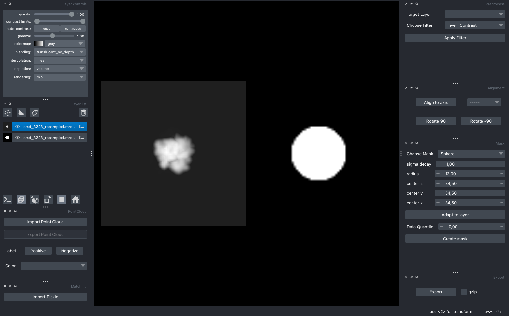
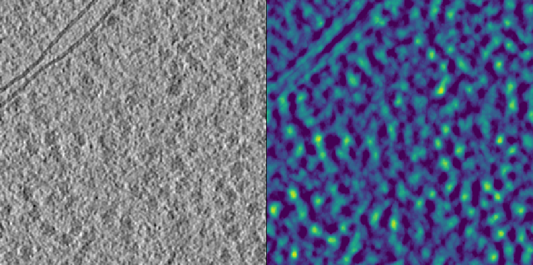
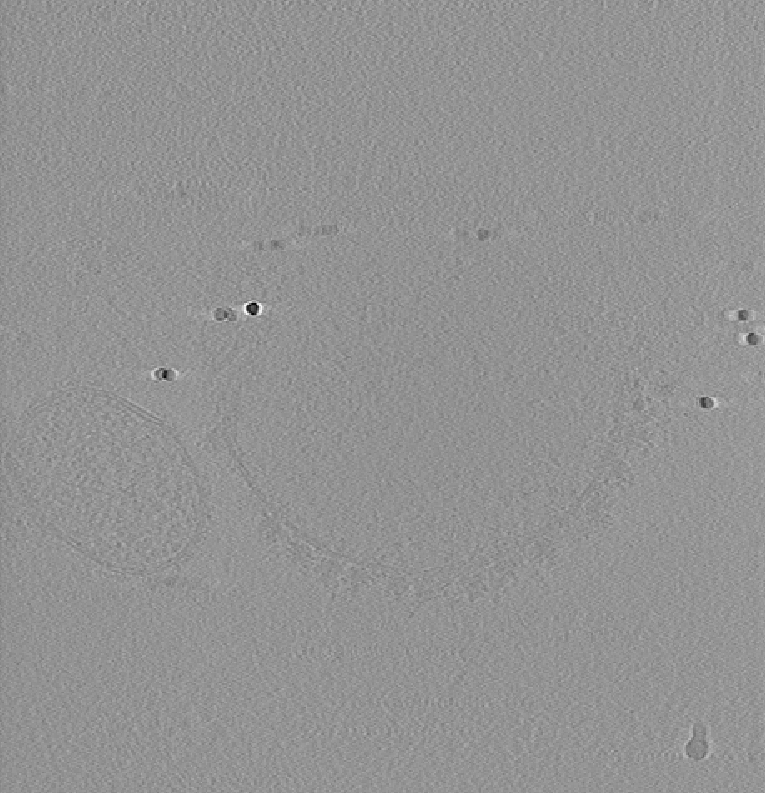
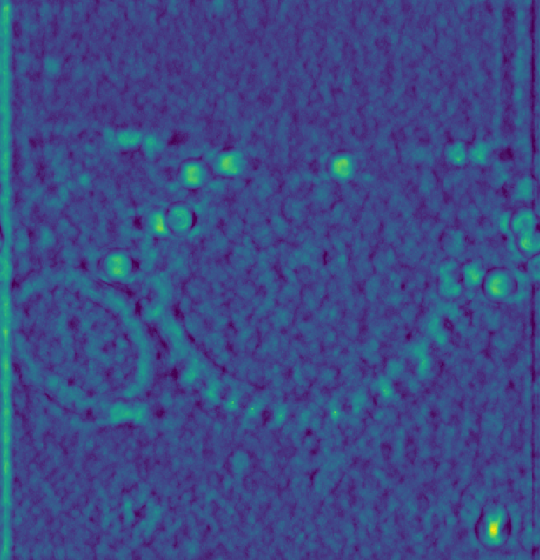
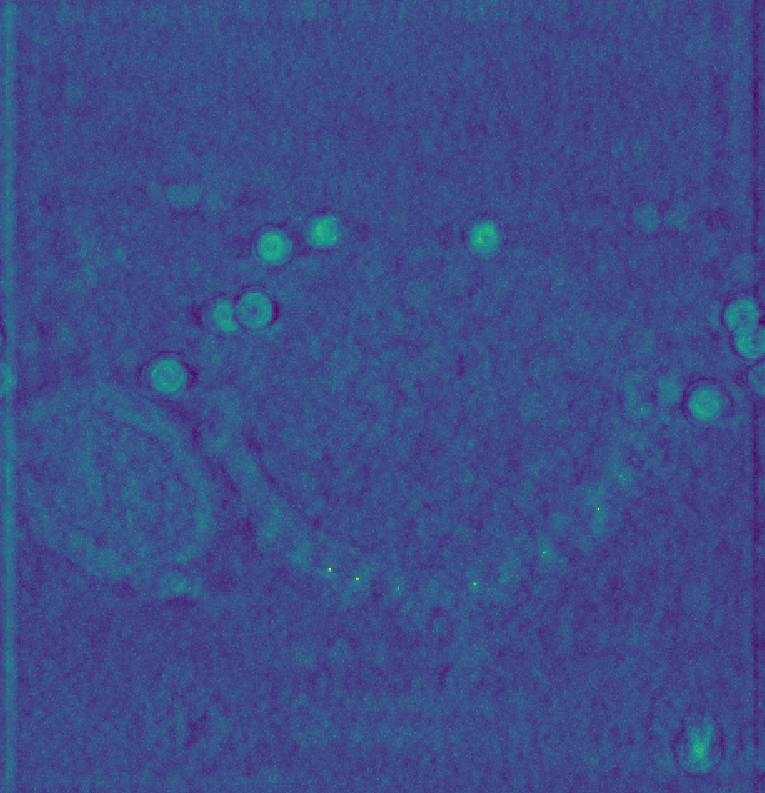

.. include:: ../../substitutions.rst

=================
Picking Ribosomes
=================

In the following we will use template matching to to identify and isolate ribosomes from a tomogram using a density map as a template.

The tomogram TS_037.rec is part of the dataset EMPIAR-10988 and can be `downloaded <https://www.ebi.ac.uk/empiar/EMPIAR-10988/>`_ from the section titled *2. Reconstructed cryo-electron tomograms acquired with defocus-only (DEF) on S. pombe cryo-FIB lamellae*. The template used is EMD-3228, which you can download by clicking `here <https://ftp.ebi.ac.uk/pub/databases/emdb/structures/EMD-3228/map/emd_3228.map.gz>`_. Alternatively, you can use wget:

.. code-block:: bash

    wget https://ftp.ebi.ac.uk/pub/databases/emdb/structures/EMD-3228/map/emd_3228.map.gz

Template and Mask Generation
----------------------------

EMD-3228 is at a different sampling rate than the binned tomogram. Although ``match_template.py`` can perform resampling on the fly, its generally recommended to provide a template with the correct sampling rate. This can either be achieved using the API (see :py:meth:`Density.resample <tme.density.Density.resample>` or using ``preprocess.py``. The right box size depends on the use-case, but generally speaking, larger boxes enable more accurate frequency operations and are essential for oscillating filters like the CTF. As a rule of thumb, you can set the box size to two times the minimum enclosing box.

.. code-block:: bash

    preprocess.py \
        -m emd_3228.map.gz \
        --sampling_rate 13.48 \
        --box_size 70 \
        --invert_contrast \
        -o emd_3228_resampled.mrc

.. note::

    The cisTEM tool `simulate <https://grigoriefflab.umassmed.edu/simulate>`_ is a good alternative for template generation.

We can use the GUI to create a template mask. Since we inverted the template, do yourself a favor and use the *Invert Contrast* filter on the template. Alternatively, you can do this programatically, given you know the required mask dimensions

.. code-block:: python

    from tme import Density
    from tme.matching_utils import create_mask

    mask = create_mask(
        mask_type="ellipse",
        radius=(13,13,13),
        center=(34.50,34.50,34.50),
        sigma_decay = 1,
        shape=(70,70,70)
    )
    mask = Density(mask, sampling_rate=13.48)
    mask.to_file("emd_3228_resampled_mask.mrc")

Your mask and template should look similar to the projection below

Template Matching
-----------------

For demonstration purposes we are going to process a subset of the data. However, the procedure for the full tomogram would be identical.

.. code-block:: python

    from tme import Density

    dens = Density.from_file("TS_037.rec")
    dens.data = dens.data[100:400, 450:750, 150:450]
    dens.to_file("TS_037_subset.mrc")

Executing the following code will run template matching, using the common 40 Ångstrom lowpass filter to avoid bias towards high-frequency components. If you are performing this analysis on your laptop, make sure to increase the angular sampling rate from 6 to 15. If you are on an M-series MacBook you can add ``--backend jax`` to make use of the integrated GPU.

.. code-block:: bash

    match_template.py \
        -m TS_037_subset.mrc \
        -i emd_3228_resampled.mrc \
        --template_mask emd_3228_resampled_mask \
        --lowpass 40 \
        -a 6 \
        -n 4 \
        --no_centering \
        --use_gpu \
        -o output_default.pickle

.. note::

    You can inspect the results in the GUI by clicking the *Import Pickle* button.

The figure below shows a lowpass-filtered representation of the tomogram subset on the left and the corresponding template matching scores on the right. Overall, the majority of ribosomes appear to be accounted for. However, the peaks are fairly wide, and some represent erroneous matches to membranes and gold markers.

Parameter Comparison
--------------------

The following outlines common filtering approaches we have tried so you do not have to. Due to the dynamic ranges of the scores and unique color mapping in napari, we can not directly determine which filtering method is optimal. However, we do note that peak shape and amplitude relative to the background can be optimized by going beyond the trivial example shown above.

.. tab-set::

    .. tab-item:: Bandpass

        .. figure:: ../../_static/quickstart/picking_bandpass.png
            :width: 100 %
            :align: center

        The figure above was generated using the following

        .. code-block:: bash

            match_template.py \
                -m TS_037_subset.mrc \
                -i emd_3228_resampled.mrc \
                --template_mask emd_3228_resampled_mask.mrc \
                --lowpass 40 \
                --highpass 400 \
                -a 6 \
                -n 4 \
                --no_centering \
                --use_gpu

    .. tab-item:: Whitening

        .. figure:: ../../_static/quickstart/picking_whiten.png
            :width: 100 %
            :align: center

        The figure above was generated using the following

        .. code-block:: bash

            match_template.py \
                -m TS_037_subset.mrc \
                -i emd_3228_resampled.mrc \
                --template_mask emd_3228_resampled_mask.mrc \
                --lowpass 40 \
                --whiten \
                -a 6 \
                -n 4 \
                --no_centering \
                --use_gpu

    .. tab-item:: CTF

        .. figure:: ../../_static/quickstart/picking_ctf.png
            :width: 100 %
            :align: center

        The figure above was generated using the following

        .. code-block:: bash

            match_template.py \
                -m TS_037_subset.mrc \
                -i emd_3228_resampled.mrc \
                --template_mask emd_3228_resampled_mask.mrc \
                --lowpass 40 \
                --defocus 30000 \
                --amplitude_contrast 0.08 \
                --no_flip_phase \
                -a 6 \
                -n 4 \
                --no_centering \
                --use_gpu

    .. tab-item:: Background Norm

        .. figure:: ../../_static/quickstart/picking_norm.png
            :width: 100 %
            :align: center

        The figure above was generated using the following

        .. code-block:: bash

            match_template.py \
                -m TS_037_subset.mrc \
                -i emd_3228_resampled.mrc \
                --template_mask emd_3228_resampled_mask.mrc \
                --lowpass 40 \
                --scramble_phases \
                --invert_target_contrast \
                -a 6 \
                -n 4 \
                --use_gpu \
                --no_centering \
                -o output_scramble.pickle

        .. code-block:: python

            import numpy as np
            from tme.matching_utils import load_pickle, write_pickle

            data = load_pickle("output_default.pickle")
            data_background = load_pickle("output_scramble.pickle")
            data[0] = (data[0] - data_background[0]) / (1 - data_background[0])
            np.fmax(data[0], 0, out=data[0])
            write_pickle(data, "norm.pickle")

    .. tab-item:: Wedge

        .. figure:: ../../_static/quickstart/picking_wedge.png
            :width: 100 %
            :align: center

        The figure above was generated using the following

        .. code-block:: bash

            match_template.py \
                -m TS_037_subset.mrc \
                -i emd_3228_resampled.mrc \
                --template_mask emd_3228_resampled_mask.mrc \
                --lowpass 40 \
                --tilt_angles 35,35 \
                --wedge_axes 0,2 \
                -a 6 \
                -n 4 \
                --no_centering \
                --use_gpu

.. note::

    The optimal filter would need to be determined by comparing the identified peaks to a ground truth dataset, which we do in a future tutorial.

Remarks on Tomogram Preprocessing
---------------------------------

We have seen that template matching performance can be improved using a variety of strategies. However, ultimately, its limited by the quality of the experimental data.

Denoising approaches have recently found popularity, due to their ability to generate visually appealing tomograms. However, that does not necessarily make them more suitable for template matching. Cross-correlation-based template matching is fairly robust towards Gaussian and Poisson noise, which is commonly removed in denoising, leading to an overall reduction of high-frequency information. It is however, the high frequency information, that enables truly unambigous template matching [1]_. Albeit not possible to draw a general conclusion, denoising is most likely not the place to start if template matching is not working.

Instead, processing before tomogram reconstruction, such as tilt-series alignment and CTF correction should be prioritized. To demonstrate the utility of CTF correction, we use a tomogram from that was CTF corrected using IMOD's phase-flip (`source <https://dataverse.nl/dataset.xhtml?persistentId=doi:10.34894/TLGJCM>`_).

Shown below is the raw data on the left, baseline scores in the middle, and sores using a CTF-corrected template on the right, which reproduces the results from Chaillet et al. [2]_.

The figure above was generated using the following template

.. code-block:: bash

    wget https://ftp.ebi.ac.uk/pub/databases/emdb/structures/EMD-2938/map/emd_2938.map.gz

    preprocess.py \
        -m emd_2938.map.gz \
        --sampling_rate 13.79 \
        --box_size 60 \
        --invert_contrast \
        -o emd_2938_resampled.mrc

and a spherical mask

.. code-block:: python

    from tme import Density
    from tme.matching_utils import create_mask

    mask = create_mask(
        mask_type="ellipse",
        radius=(12,12,12),
        center=(30,30,30),
        sigma_decay=1,
        shape=(60,60,60)
    )
    mask = Density(mask, sampling_rate = 13.79)
    mask.to_file("emd_2938_resampled_mask.mrc")

CTF parameters were omitted from the command below to compute baseline scores

.. code-block:: bash

    match_template.py \
        -i emd_2938_resampled.mrc \
        --template_mask emd_2938_resampled_mask.mrc \
        -m tomo200528_100.mrc \
        -a 6 \
        --lowpass 40 \
        --defocus 30000 \
        --amplitude_contrast 0.08 \
        --spherical_aberration 27000000.0 \
        --acceleration_voltage 200 \
        --no_centering \
        --use_gpu

With CTF correction in place, we can move to more complex correction approaches such as true 3D-CTF corrected templates, defocus gradient incorporation, and tilt weighting. These will be covered in a future tutorial.

References
----------

.. [1] Maurer, V. J.; Siggel, M.; Kosinski, J. What shapes template-matching performance in cryogenic electron tomography in situ?. Acta Crys D 2024
.. [2] Chaillet, M.L.; van der SChot, G; Gubbins, I.; Roet, S., Veltkamp, R.C; Foerster, F. Int. J. Mol. Sci  2023

