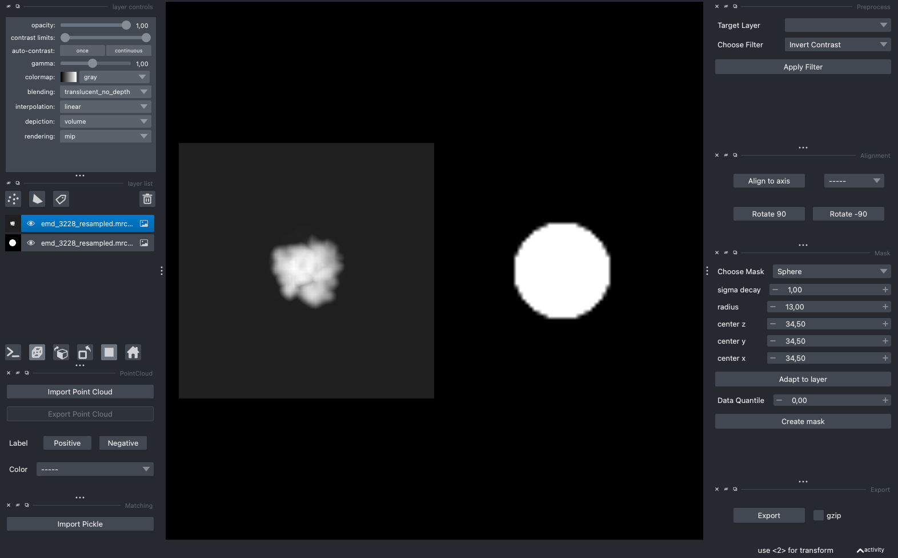
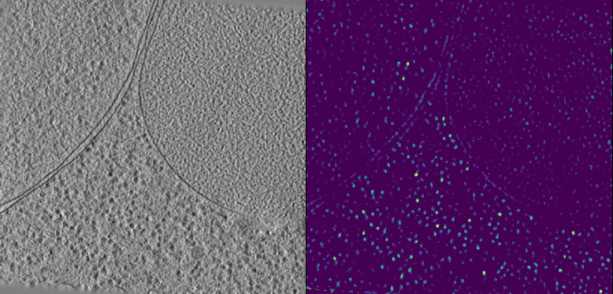
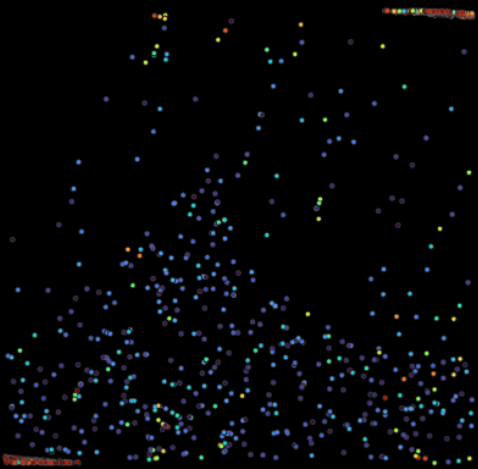
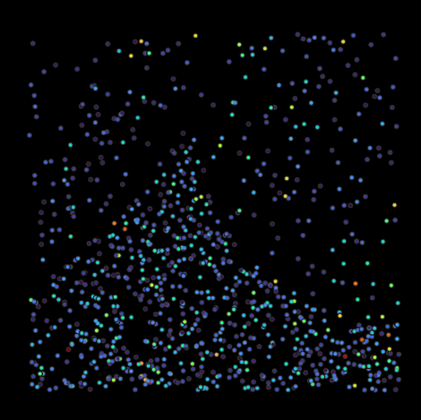
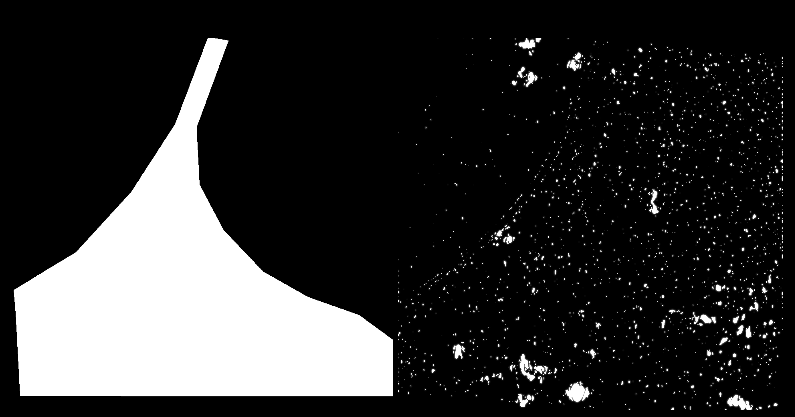
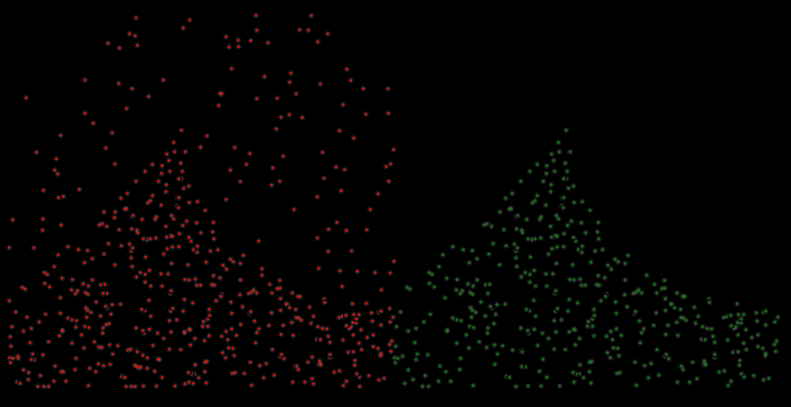

.. include:: ../../substitutions.rst

=================
Picking Ribosomes
=================

This tutorial demonstrates how to identify and extract ribosome locations from cryo-electron tomograms using template matching. You will learn

- How to prepare templates and masks for template matching
- How to run template matching with various filtering options
- How to interpret and optimize template matching results

Data Acquisition
----------------

For this tutorial, we use data from `EMPIAR-10988 <https://www.ebi.ac.uk/empiar/EMPIAR-10988/>`_. You will need to download

.. code-block:: text

    EMPIAR-10988/
    └── data/
        └── DEF/
            ├── tomograms/
            │   └── TS_037.rec          # Main tomogram file
            └── metadata/
                └── mdocs_modified/
                    └── TS_037.mdoc     # Tilt series metadata

As 80S ribosome template, we will use `EMD-3228 <https://ftp.ebi.ac.uk/pub/databases/emdb/structures/EMD-3228/map/emd_3228.map.gz>`_

.. code-block:: bash

    wget https://ftp.ebi.ac.uk/pub/databases/emdb/structures/EMD-3228/map/emd_3228.map.gz

Your working directory should now contain

.. code-block:: text

    tutorial_directory/
    ├── TS_037.rec              # Tomogram
    ├── TS_037.mdoc             # Metadata
    └── emd_3228.map.gz         # Template

Template and Mask Generation
----------------------------

We can resample EMD-3228 to match our tomogram using ``pytme template``

.. code-block:: bash

    pytme template \
        -m emd_3228.map.gz \
        --sampling-rate 13.48 \
        --box-size 70 \
        --invert-contrast \
        --output emd_3228_resampled.mrc

Sufficiently sized boxes are essential for oscillating filters like the CTF. As a rule of thumb, set the box size to about twice the minimum enclosing box of your structure.

.. note::

    The cisTEM tool `simulate <https://grigoriefflab.umassmed.edu/simulate>`_ is a good alternative for template generation.

The mask defines which parts of the template to use for matching. Here we use ``pytme gui`` to create the mask interactively, but alternatively this can be done using

.. tab-set::

    .. tab-item:: Command line

        .. versionadded:: 0.3.4

        .. code-block:: bash

            pytme utils mask \
                --template emd_3228_resampled.mrc \
                --shape ellipse \
                --radius 13 \
                --soft-edge-width 3 \
                -o emd_3228_resampled_mask

    .. tab-item:: Python API

        .. code-block:: python

            from tme import Density
            from tme.matching_utils import create_mask

            mask = create_mask(
                mask_type="ellipse",
                radius=(13, 13, 13),
                center=(35, 35, 35),
                soft_edge_width=3,
                method="cosine",
                shape=(70, 70, 70),
            )
            Density(mask, sampling_rate=13.48).to_file("emd_3228_resampled_mask.mrc")

Your prepared template and mask should look similar to the projection below

    Template (left) and mask (right) for template matching

Template Matching
-----------------

For demonstration purposes we are going to process a subset of the data. However, the procedure for the full tomogram would be identical.

.. code-block:: python

    from tme import Density

    # Load the full tomogram
    dens = Density.from_file("TS_037.rec")

    # Extract a subset for faster processing (X: 100-400, Y: 450-750, Z: 150-450)
    # This creates a 300x300x300 voxel region containing multiple ribosomes
    dens.data = dens.data[100:400, 450:750, 150:450]

    # Save the subset for template matching
    dens.to_file("TS_037_subset.mrc")

The code below will run template matching, taking about 1-2 minutes on a consumer-level GPU or 5-10 minutes on CPU (if you are running on CPU, make sure to set the number of cores via ``--cores``). For GPU acceleration: add ``--backend cupy`` (NVIDIA, or pytorch/jax) or ``--backend jax`` (M-series Mac).

.. code-block:: bash

    pytme match \
        --target TS_037_subset.mrc \
        --template emd_3228_resampled.mrc \
        --template-mask emd_3228_resampled_mask.mrc \
        --lowpass 40 \
        --angular-sampling 8 \
        --output output_default.pickle

.. warning::

    When using non-spherical masks, add ``--score FLC``, or consult the :ref:`scoring functions <scoring-table>`.

You can inspect the results in the GUI by clicking the *Import Pickle* button. The figure below shows the deconvolved data on the left and the corresponding template matching scores on the right. Bright spots in the score map indicate potential ribosome locations, the brighter the spot the better the match.

Overall, the majority of ribosomes appear to be accounted for. However, note that

- **Wide peaks**: Multiple high-scoring voxels around each ribosome
- **False positives**: Some bright spots on membranes and gold markers

.. list-table::
   :widths: 50 50
   :class: transparent-table

   * - .. figure:: ../../_static/quickstart/data_deconv.png
          :width: 100%

          Deconvolved tomogram

     - .. figure:: ../../_static/quickstart/default.png
          :width: 100%

          Template matching scores

Parameter Comparison
--------------------

The following outlines common filtering approaches to improve template matching results. When processing cryo-ET data, you should at least use missing wedge correction, and add CTF if you have the parameter estimated. Background normalization can be useful to reduce the contribution of dense areas to template matching scores, e.g., membranes or fiducial gold markers. Bandpass filters are useful when specific frequency ranges contain information irrelevant for template matching. Spectral whitening enhances weak signals but may overamplify noise.

.. tab-set::

    .. tab-item:: Missing Wedge

        Missing wedge correction accounts for the anisotropic resolution in tomograms. The template can be modulated using either a continuous wedge or a more accurate per-tilt mask. For a continuous wedge mask

        .. code-block:: bash

            pytme match \
                --target TS_037_subset.mrc \
                --template emd_3228_resampled.mrc \
                --template-mask emd_3228_resampled_mask.mrc \
                --lowpass 40 \
                --tilt-angles 35,35 \
                --angular-sampling 8 \
                --output output_contwedge.pickle

        For a step wedge mask

        .. code-block:: bash

            pytme match \
                --target TS_037_subset.mrc \
                --template emd_3228_resampled.mrc \
                --template-mask emd_3228_resampled_mask.mrc \
                --lowpass 40 \
                --tilt-angles TS_037.mdoc \
                --angular-sampling 8 \
                --output output_stepwedge.pickle

        Instead of binary masks, the wedge can also be weighted based on the cosine of the tilt angle or the electron dose to more faithfully recapitulate the data acquisition process. For instance, to reproduce the weighting scheme of relion

        .. code-block:: bash

            pytme match \
                --target TS_037_subset.mrc \
                --template emd_3228_resampled.mrc \
                --template-mask emd_3228_resampled_mask.mrc \
                --lowpass 40 \
                --tilt-angles TS_037.mdoc \
                --tilt-weighting relion \
                --angular-sampling 8 \
                --output output_weightedstepwedge.pickle

        .. list-table:: Template matching scores by wedge mask type
           :widths: 33 33 33
           :class: transparent-table

           * - .. figure:: ../../_static/quickstart/wedge_cont.png
                  :width: 100%

                  Continuous wedge mask

             - .. figure:: ../../_static/quickstart/wedge_step.png
                  :width: 100%

                  Per-tilt wedge mask

             - .. figure:: ../../_static/quickstart/wedge_weighted.png
                  :width: 100%

                  Weighted per-tilt wedge mask

        .. tip::

            The ``--tilt-angles`` argument can directly use Warp/M XML files, mdoc, tomostar and text files. The latter contain either the tilt angles as single value per line, or two tab-separated columns with column names 'angles' and 'weights'.

    .. tab-item:: CTF

        CTF correction recovers high-resolution information and produces sharper peaks with better separation of closely spaced ribosomes. In the simplest case, a single defocus value can be provided, assuming constant defocus throughout the volume. 3D CTFs can be created using Warp/M XML, tomostar, mdoc, and ctffind4 files (use ``pytme match --help`` to see all available formats for the ctf file).

        For constant 3µm defocus (30000 Å)

        .. code-block:: bash

            pytme match \
                --target TS_037_subset.mrc \
                --template emd_3228_resampled.mrc \
                --template-mask emd_3228_resampled_mask.mrc \
                --defocus 30000 \
                --amplitude-contrast 0.08 \
                --acceleration-voltage 300 \
                --spherical-aberration 27000000.0 \
                --angular-sampling 8 \
                --output output_ctf.pickle

        The CTF can be specified per tilt to create a 3D CTF filter. However, note that the CTF parameter estimates in the MDOC file are only a starting point, and should be replaced by estimates from dedicated software for optimal results.

        .. code-block:: bash

            pytme match \
                --target TS_037_subset.mrc \
                --template emd_3228_resampled.mrc \
                --template-mask emd_3228_resampled_mask.mrc \
                --ctf-file TS_037.mdoc \
                --amplitude-contrast 0.08 \
                --acceleration-voltage 300 \
                --spherical-aberration 27000000.0 \
                --angular-sampling 8 \
                --output output_3dctf.pickle

        .. list-table:: Template matching scores by CTF
           :widths: 50 50
           :class: transparent-table

           * - .. figure:: ../../_static/quickstart/ctf.png
                  :width: 100%

                  Constant defocus CTF

             - .. figure:: ../../_static/quickstart/3dctf.png
                  :width: 100%

                  3D CTF

        .. tip::

            Using a 3D CTF will implicitly apply a step wedge mask. [Experts] the approach by which the 3D CTF is constructed from 2D tilts can be modified using ``--reconstruction-filter`` and ``reconstruction-interpolation-order`` for optimal results.

    .. tab-item:: Background Norm

        Background normalization reduces the contribution of dense cellular features to template matching scores and helps handle contamination artifacts. In the simplest case, a noise version of the current template can be used for normalization

        .. code-block:: bash

            pytme match \
                --target TS_037_subset.mrc \
                --template emd_3228_resampled.mrc \
                --template-mask emd_3228_resampled_mask.mrc \
                --lowpass 40 \
                --background-correction phase-scrambling \
                --angular-sampling 8 \
                --output output_scramble.pickle

        Instead of noise, you can also template match using any other cellular component you would like to avoid, e.g., membranes, fiducial markers or alternative macromolecules. Such runs can be used for normalization in post

        .. code-block:: bash

            pytme postprocess \
                --input-file output_default.pickle \
                --background-file output_scramble.pickle \
                --output-format pickle \
                --output-prefix output_norm.pickle

        .. figure:: ../../_static/quickstart/norm.png
            :width: 100 %
            :align: center

            Template matching scores for background normalization

        .. note::

            We use ``--output-format pickle`` for visualization. There is no need to create this intermediary file in practice.

    .. tab-item:: Bandpass

        Bandpass filtering removes specific frequency ranges that may contain artifacts or noise while preserving the relevant structural information. This is particularly useful when low frequencies are dominated by cellular background or high frequencies contain excessive noise.

        .. code-block:: bash

            pytme match \
                --target TS_037_subset.mrc \
                --template emd_3228_resampled.mrc \
                --template-mask emd_3228_resampled_mask.mrc \
                --lowpass 40 \
                --highpass 400 \
                --angular-sampling 8 \
                --output output_bandpass.pickle

        .. figure:: ../../_static/quickstart/bandpass.png
            :width: 100 %
            :align: center

            Template matching scores for bandpass filter

    .. tab-item:: Whitening

        Spectral whitening flattens the power spectrum to enhance weak signals across all frequencies, which can improve detection of ribosomes in noisy regions. However, this approach may also amplify noise, so it should be used judiciously depending on the signal-to-noise ratio of your data.

        .. code-block:: bash

            pytme match \
                --target TS_037_subset.mrc \
                --template emd_3228_resampled.mrc \
                --template-mask emd_3228_resampled_mask.mrc \
                --lowpass 40 \
                --whiten \
                --angular-sampling 8 \
                --output output_whitening.pickle

        .. figure:: ../../_static/quickstart/whitening.png
            :width: 100 %
            :align: center

            Template matching scores for spectral whitening

Obtaining a Particle List
-------------------------

We can obtain a particle list from template matching results using ``pytme postprocess.`` Recall the output of the previous template matching run. The peaks are fairly
wide, well separated, and most likely include some false-positive results.

|project| ships several peak callers; the appropriate choice depends on the
data. :py:class:`PeakCallerScipy <tme.analyzer.PeakCallerScipy>` is suitable
here. In more crowded settings, :py:class:`PeakCallerMaximumFilter
<tme.analyzer.PeakCallerMaximumFilter>` typically gives better results. The
command below identifies up to 1,000 peaks with PeakCallerScipy and writes
them to a STAR file.

.. code-block:: bash

    pytme postprocess \
        --input-file output_default.pickle \
        --output-prefix orientations

Peaks can be imported into the GUI via drag-and-drop. A 2D projection of the
point cloud colored by score is shown below. Some peaks are correctly identified in the
centre, but many are too tightly packed and clustered around the tomogram
borders. Inflated scores at the tomogram borders are common and arise from
reconstruction artifacts and from padding during template matching.

The errors above can be avoided by setting a minimum distance between peaks
and masking the edges of the tomogram, which excludes all scores computed
using padding. Edge masking is based on the template shape. For heavily
zero-padded templates, the exact distance can be set with
``--min-boundary-distance``.

.. code-block:: bash

    pytme postprocess \
        --input-file output_default.pickle \
        --output-prefix orientations_distance \
        --min-distance 15 \
        --mask-edges

Distance constraints and edge masking lead to a better separation between
peaks and remove erroneous matches from the boundaries. However, with no
constraint on minimum score or peak count, the result still includes many
low-scoring particles. The number of peaks can be capped, score bounds can
be set explicitly, or a suitable cutoff can be derived from the score
statistics.

.. code-block:: bash

    pytme postprocess \
        --input-file output_default.pickle \
        --output-prefix orientations_distance_score \
        --min-distance 15 \
        --mask-edges \
        --n-false-positives 5

Refinement
----------

The steps above yield a suitable dataset for downstream classification,
refinement, and averaging in the majority of cases. The following additional
steps can be used to obtain a purer dataset.

Target Masking
^^^^^^^^^^^^^^

The GUI can be used to define a target mask, specifying which regions of the
target should be considered. Create a new *Shapes* layer in the GUI and press
*P* to draw a polygon encapsulating the region of interest. Select the
tomogram you want to mask and *Shape* from the *Choose Mask* tab, then click
*Create Mask* to propagate the polygon through the remaining axis.
Alternatively, select *Threshold* to mask elements that deviate significantly
from the average density in the tomogram. An example mask projection
obtained with both approaches is shown below.

Manual Curation
^^^^^^^^^^^^^^^

The GUI can also be used to exclude erroneous picks. Locate the layer
controls in the top-left and use the *Select Points* tool. Select the points
to exclude and press the delete key to remove them. Picks that were not
considered before can be added using *Add Points*; their angular orientation
will be trivial in that case. Once the picks are filtered, use *Export Point
Cloud* to write a final orientations file for further analysis.

See :doc:`/quickstart/overview` for background correction, which is another
route to a cleaner particle set.

Validation
----------

The final picks obtained with distance constraints and score cutoffs are
shown below on the left. The right side shows the final picks obtained by
passing a target mask to ``pytme postprocess``.

Comparing the final picks to `ground truth picks <https://www.ebi.ac.uk/empiar/EMPIAR-10988/>`_ yields 90% [335 / 398] accuracy.
