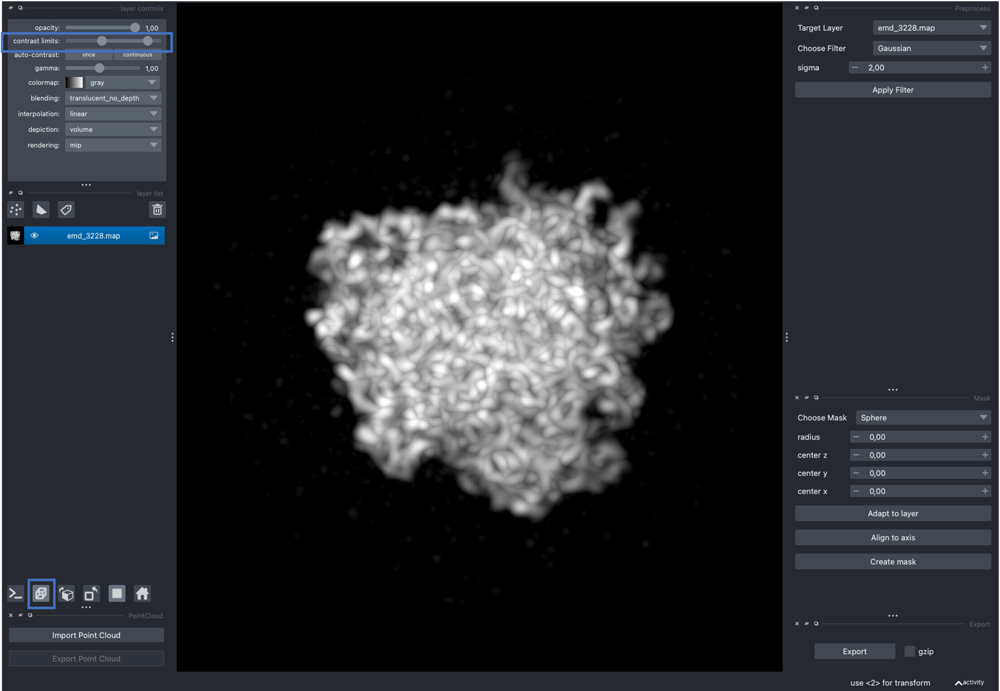
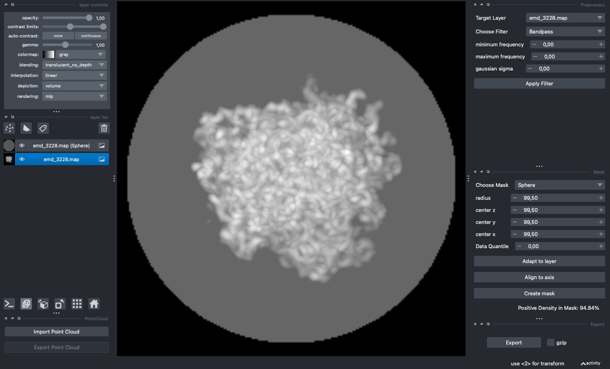
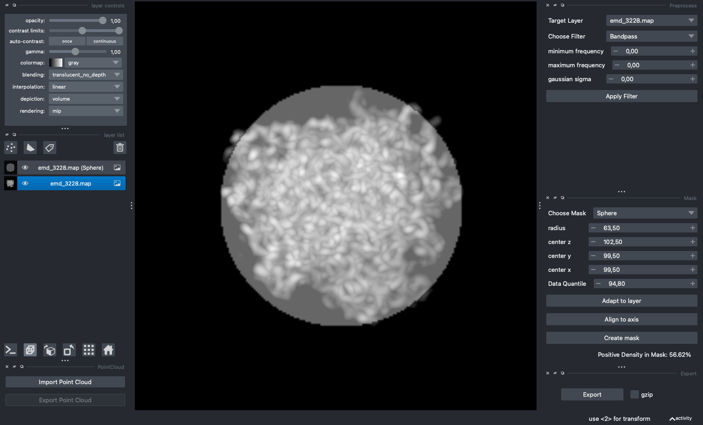
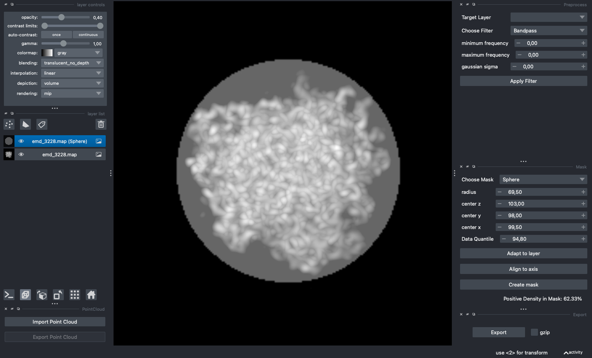
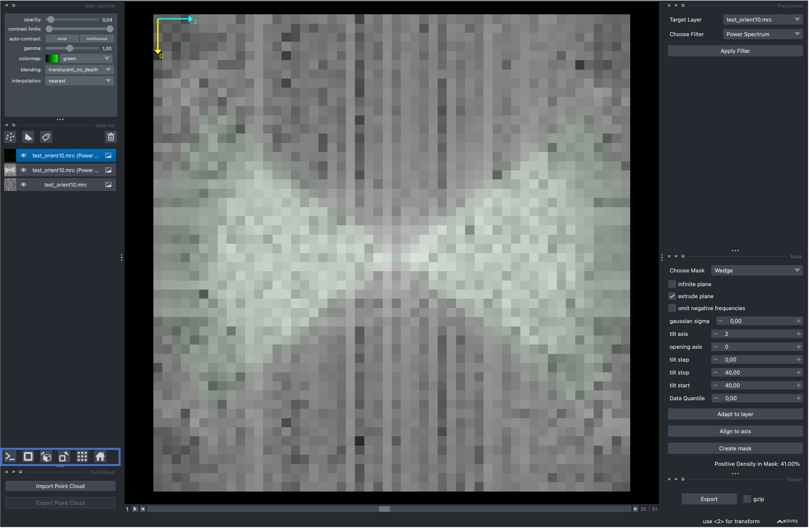

.. include:: ../../substitutions.rst

=============
Using the GUI
=============

The following command will launch a `napari` viewer embedded with custom widgets for preprocessing. For a detailed description of all GUI elements please have a look at the `napari documentation <https://napari.org/stable/tutorials/fundamentals/quick_start.html>`_.

.. code-block:: bash

    pytme gui

Image actions
-------------

The Image Actions widget exposes two operations on the active image layer. ``Power spectrum`` is useful for inspecting the missing wedge before configuring a wedge mask. ``Invert contrast`` is useful when the colormap toggle alone does not produce a readable density. Both create a new layer and leave the originals untouched.

For template generation, contrast inversion, lowpass filtering, axis alignment, and resampling, use ``pytme template`` from the command line.

Masking
-------

The mask widget is operated analogously. The example uses the averaged electron microscope map EMD-3228. Increasing the lower bound on the contrast in the *layer controls* widget and toggling the display mode (highlighted in blue) yield a more informative visualisation of the map.

The dropdown menu allows users to choose from a variety of masks with a given set of parameter. The `Adapt to layer` button will determine initial mask parameters based on the data of the currently selected layer. `Align to axis` will rotate the axis of largest variation in the selected layer onto the z-Axis, which can simplify mask creation for cases whose initial positioning is suboptimal. `Create mask` will create a specified mask for the currently selected layer.

Clicking *Adapt to layer* followed by *Create mask* produces a sphere that is excessively large. EMD-3228 contains a fair amount of noisy unstructured density around the central structure. Reducing the lower bound on the contrast limit slider makes this visible.

We can either adapt the mask manually, or make use of the Data Quantile feature. The Data Quantile allows us to only consider a given top percentage of the data for mask generation. In this case, 94.80 appeared to be a reasonable cutoff. Make sure to select the non-mask layer before clicking on `Adapt to layer`. The output is displayed below.

The mask is now more reasonable but cuts off some parts of the map. Fine-tuning the parameters manually until the mask encapsulates the most important features yields a better result.

The generated masks can now be exported for subsequent use in template matching.

Finally, we can also use the viewer to determine the wedge mask specification. For this, drag and drop a CCP4/MRC file for which you would expect a missing wedge into the viewer. With the layer active, click ``Power spectrum`` in the Image Actions widget to visualize the missing wedge. You might need to switch the image axis using the widgets on the bottom left. Once the wedge is visible, enable axis using View > Axes > Axes visible. Head over to the mask widget and select wedge. The opening axis corresponds to the axis that runs through the void defined by the wedge, the tilt axis is the axis the plane is tilted over. For the data in the example below, a tilt range of (40, 40), tilt axis 2 and opening axis 0 appears sufficient. ``pytme match`` follows the same conventions, as you will see in subsequent tutorials.

