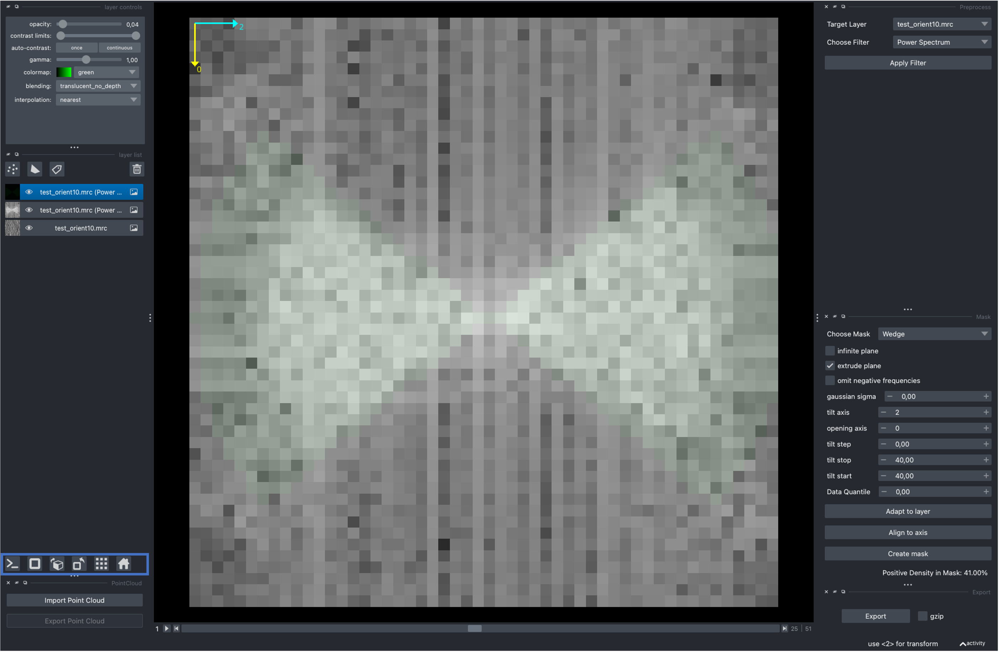

.. include:: ../../substitutions.rst

=============
Using the GUI
=============

The following command will launch a `napari` viewer embedded with custom widgets for preprocessing. For a detailed description of all GUI elements please have a look at the `napari documentation <https://napari.org/stable/tutorials/fundamentals/quick_start.html>`_.

.. code-block:: bash

 preprocessor_gui.py

.. note::

	Using the GUI requires following the installation procedure outlined in the :ref:`gui-installation`.

Filtering
---------

The GUI will appear similar to the figure below. |project| defines a range of widgets, of which three are relevant for this example. The widget in orange contains a variety of filtering methods, the widget in blue can be used to create masks, and the green widget on the bottom right is used to export data to disk.

.. figure:: ../../_static/examples/napari_boot.png
 :width: 100 %
 :align: center

Simply drag and drop your data in into `napari` to import it (See :py:meth:`Density.from_file <tme.density.Density.from_file>` for available formats). Clicking the `Apply Filter` button will apply the filter to the target layer and create a new layer on the left hand side. The name of the new layer is indicative of the filter type used. The figure below shows tomogram TS_037 from `EMPIAR-10988 <https://www.ebi.ac.uk/empiar/EMPIAR-10988/>`_ before (left) and after application of a Gaussian filter (right).

.. figure:: ../../_static/examples/napari_filter_widget_tomogram.png
 :width: 100 %
 :align: center

After selecting an adequate filter and parameter set the filtered data can be exported via the export button. Pressing the export button will open a separate window to determine the save location. If you applied a filter to the data, `napari` will also create a yaml file that contains the utilized parameters. Assuming your output is named `filtered.mrc`, the corresponding yaml file will be `filtered.yaml`.

For the tomogram example above, the yaml file will contain the following:

.. code-block:: yaml

 - gaussian_filter:
    sigma: 2.0

Masking
-------

The mask widget is operated anologously. In the following, we consider an averaged electron microscope map EMD-3228. We can increase the lower bound on the contrast in the `layer controls` widget and use the display mode toggle highlighted in blue, to obtain a more informative visualization of the map.

.. figure:: ../../_static/examples/napari_mask_widget_intro.png
 :width: 100 %
 :align: center

The dropdown menu allows users to choose from a variety of masks with a given set of parameter. The `Adapy to layer` button will determine initial mask parameters based on the data of the currently selected layer. `Align to axis` will rotate the axis of largest variation in the selected layer onto the z-Axis, which can simplify mask creation for cases whose initial positioning is suboptimal. `Create mask` will create a specified mask for the currently selected layer.

When clicking `Adapy to layer` followed by `Create mask`, we observe that the resulting sphere is excessively large. This is because EMD-3228 contains a fair amount of noisy unstructed density around the center structure. This can be assessed by reducing the lower bound on the contrast limit slider.

.. figure:: ../../_static/examples/napari_mask_widget_map.png
 :width: 100 %
 :align: center

We can either adapt the mask manually, or make use of the Data Quantile feature. The Data Quantile allows us to only consider a given top percentage of the data for mask generation. In this case, 94.80 appeared to be a reasonable cutoff. Make sure to select the non-mask layer before clicking on `Adapy to layer`. The output is displayed below.

.. figure:: ../../_static/examples/napari_mask_widget_map2.png
 :width: 100 %
 :align: center

Albeit more reasonable, the mask now cuts-off some parts of the map. We can mitigate this by manually fine-tuning the parameters until the mask at least encapsulates the most important features of the map.

.. figure:: ../../_static/examples/napari_mask_widget_map3.png
 :width: 100 %
 :align: center

The generated masks can now be exported for subsequent use in template matching.

Finally, we can also use the viewer to determine the wedge mask specification. For this, drag and drop a CCP4/MRC file for which you would expect a missing wedge into viewer. Select and apply the `Power Spectrum` filter to visualize the missing wedge. You might need to switch the image axis using the widgets on the bottom left. Once the wedge is visible, enable axis using View > Axes > Axes visible. Head over to the mask widget and select wedge. The opening axis corresponds to the axis that runs through the void defined by the wedge, the tilt axis is the axis the plane is tilted over. For the data in the example below, a tilt range of (40, 40), tilt axis 2 and opening axis 0 appears sufficient. ``match_template.py`` follows the same conventions, as you will see in subsequent tutorials.

.. note::

	Napari sometimes exits with a bus_error on MacOS systems. Usually its sufficient to reinstall napari and its dependencies, especially pyqt.
